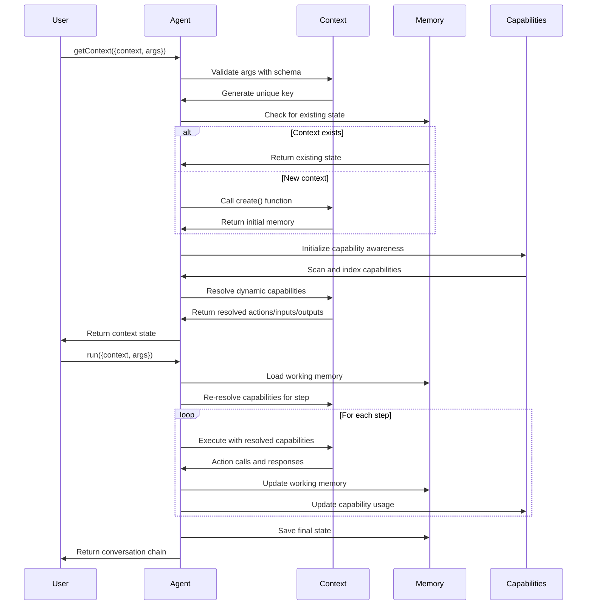

# Claude Development Guide

This document contains important information for Claude Code when working on the Daydreams project.

## Project Overview

Daydreams is a lightweight TypeScript framework for building stateful AI agents with persistent memory and multi-context capabilities. It supports both Node.js and browser environments.

## Project Structure

```
daydreams/
├── packages/           # Core framework packages
├── examples/          # Example implementations
├── clients/           # Client applications (example-ui)
├── docs/             # Documentation site
├── bot/              # Bot implementation
└── scripts/          # Build and utility scripts
```

## Development Commands

### Build Commands
- `pnpm build:packages` - Build all core packages
- `pnpm build:packages:watch` - Build packages in watch mode
- `pnpm clean` - Clean build artifacts
- `pnpm clean:deps` - Clean dependencies only

### Testing Commands
- `pnpm test` - Run tests (runs packages/core)

### Documentation Commands
- `pnpm docs:dev` - Start documentation development server
- `pnpm docs:build` - Build documentation
- `pnpm docs:start` - Start documentation production server

### Code Quality Commands
- `pnpm prettier` - Format code
- `pnpm prettier-check` - Check code formatting
- `pnpm knip` - Find unused dependencies and exports

## Package Manager

This project uses **pnpm** as the package manager with workspaces. Always use `pnpm` instead of npm or yarn.

## TypeScript Configuration

The project uses TypeScript with a monorepo setup. Each package has its own `tsconfig.json` that extends the root configuration.

## Key Technologies

- **Runtime**: Node.js 18+, Bun, Deno, Browser
- **Language**: TypeScript
- **Build Tool**: tsup
- **Package Manager**: pnpm
- **AI SDKs**: Vercel AI SDK, LangChain support
- **LLM Providers**: OpenAI, Anthropic, Google, Groq, and more

## Development Workflow

1. **Install dependencies**: `pnpm install`
2. **Build packages**: `pnpm build:packages`
3. **Start docs server**: `pnpm docs:dev` (runs on http://localhost:3000)
4. **Make changes** to packages or examples
5. **Rebuild** if needed with `pnpm build:packages`
6. **Format code**: `pnpm prettier`

## Architecture Notes

- **Multi-context system**: Agents can manage multiple stateful conversations
- **Memory persistence**: Long-term storage via pluggable stores
- **Action system**: Type-safe functions agents can execute
- **Extensions**: Platform integrations (Discord, Twitter, etc.)
- **Framework agnostic**: Works with existing AI frameworks
- **Dynamic capability system**: State-driven action resolution with capability awareness

## Context System Deep Dive

The Daydreams context system is the foundation for creating stateful, multi-conversation AI agents. Here's how it works:

### Core Context Concepts

**Context Definition**: A context is a stateful environment where an AI agent operates. Each context has:
- **Type**: A unique identifier (e.g., "chat", "research-session")
- **Schema**: Type-safe arguments validation using Zod
- **Memory**: Persistent state that survives between interactions
- **Key**: Optional function to create unique instances (e.g., per user/channel)

**Context State**: The runtime instance of a context containing:
- **Memory**: The current state data
- **Args**: Validated input arguments
- **Settings**: Configuration like max steps, model overrides
- **Working Memory**: Conversation history and action calls

### Creating Contexts

```typescript
import { context } from "@daydreamsai/core";
import { z } from "zod";

const chatContext = context({
  type: "user-chat",
  schema: z.object({ 
    userId: z.string(),
    channelId: z.string().optional()
  }),
  
  // Creates unique instances per user/channel
  key: ({ userId, channelId }) => 
    channelId ? `${userId}:${channelId}` : userId,
  
  // Initial state creation
  create: () => ({
    messages: [],
    preferences: {},
    lastActive: Date.now()
  }),
  
  // Dynamic rendering based on state
  render: ({ memory, args }) => 
    `User ${args.userId} has ${memory.messages.length} messages`,
  
  // Context-specific instructions
  instructions: (state) => 
    `You are chatting with user ${state.args.userId}. 
     Previous messages: ${state.memory.messages.length}`
});
```

### Dynamic Capability Resolution

Daydreams supports **state-driven capability resolution** where actions, inputs, outputs, and other capabilities can be dynamically determined based on context state:

```typescript
const adaptiveContext = context({
  type: "adaptive-agent",
  
  // Dynamic actions based on current focus
  actions: async (state) => {
    const baseActions = [generalActions];
    
    // Add focus-specific actions
    if (state.memory.focus?.type === "research") {
      baseActions.push(...researchActions);
    } else if (state.memory.focus?.type === "coding") {
      baseActions.push(...codingActions);
    }
    
    return baseActions;
  },
  
  // Dynamic inputs based on mode
  inputs: async (state) => {
    return state.memory.mode === "voice" 
      ? { voice: voiceInput }
      : { text: textInput };
  },
  
  // Dynamic rendering
  render: ({ memory }) => 
    `Focus: ${memory.focus?.type}, Available: ${memory.capabilities?.length} actions`
});
```

### Framework-Level Capability Awareness

Daydreams includes built-in **capability awareness** that allows agents to discover and manage their own capabilities:

```typescript
// Enable at framework level
const agent = await createDreams({
  capabilityAwareness: {
    enabled: true,           // Enable capability discovery
    autoDiscover: true,      // Auto-scan on context creation
    includeDiscoveryActions: true,  // Add discovery actions
    sources: ['agent'],      // Scan agent's registered capabilities
    maxActiveCapabilities: 20 // Limit active capabilities
  },
  contexts: [myContext]
}).start();
```

**Built-in Discovery Actions**:
- `_core.scan_capabilities`: Discover available capabilities
- `_core.list_capabilities`: List and filter capabilities
- `_core.load_capability`: Dynamically activate capabilities
- `_core.unload_capability`: Deactivate capabilities
- `_core.capability_status`: View current capability status

### Context Lifecycle

1. **Context Creation**: `agent.getContext({ context, args })`
   - Validates args against schema
   - Generates unique ID using key function
   - Loads existing state or creates new via `create()`
   - Initializes capability awareness if enabled
   - Resolves dynamic capabilities (actions, inputs, etc.)

2. **Context Execution**: `agent.run({ context, args })`
   - Creates context state if not exists
   - Loads working memory (conversation history)
   - Resolves dynamic capabilities for current step
   - Executes agent step with resolved capabilities
   - Persists updated state and working memory

3. **Context Persistence**: 
   - Memory saved via `context.save()` or auto-saved to memory store
   - Working memory (conversation) saved separately
   - Context index tracks all active contexts

### Multi-Context Support

Agents can manage multiple contexts simultaneously:

```typescript
// Different contexts for different purposes
const userChat = await agent.getContext({
  context: chatContext, 
  args: { userId: "user123" }
});

const researchSession = await agent.getContext({
  context: researchContext,
  args: { projectId: "proj456" }
});

// Each maintains separate state and memory
await agent.run({ context: chatContext, args: { userId: "user123" } });
await agent.run({ context: researchContext, args: { projectId: "proj456" } });
```

### Context Settings and Configuration

Contexts can override agent-level settings:

```typescript
const context = context({
  type: "long-research",
  maxSteps: 50,           // Override default max steps
  model: specificModel,   // Use different model
  
  setup: async (args, settings, agent) => ({
    // Custom setup logic
    apiKeys: await loadApiKeys(),
    tools: await initializeTools()
  }),
  
  onStep: async (state, agent) => {
    // Called after each step
    await logProgress(state);
  },
  
  onRun: async (state, agent) => {
    // Called after run completion
    await finalizeResults(state);
  }
});
```

### Advanced Features

**Context Composition**: Contexts can reference other contexts for complex workflows.

**Memory Strategies**: Pluggable memory backends (in-memory, Redis, databases).

**Action Isolation**: Actions can be context-specific or globally available.

**State Migration**: Contexts can evolve their memory schemas over time.

**Request Tracking**: Built-in tracking for model usage, costs, and performance.

This context system enables building sophisticated, stateful AI agents that can maintain multiple conversations, adapt their capabilities dynamically, and persist knowledge across interactions.

## Context System Architecture Diagram

```mermaid
graph TB
    %% Agent Level
    A[Agent] --> B[Capability Awareness Config]
    A --> C[Discovery Actions]
    A --> D[Registry]
    
    %% Context Definition
    CD[Context Definition] --> CS[Context Schema]
    CD --> CK[Key Function]
    CD --> CM[Create Function]
    CD --> CR[Render Function]
    CD --> CI[Instructions Function]
    CD --> DA[Dynamic Actions]
    CD --> DI[Dynamic Inputs]
    CD --> DO[Dynamic Outputs]
    
    %% Context Creation Flow
    A --> |"getContext({context, args})"| CC[Context Creation]
    CC --> V[Validate Args]
    V --> GK[Generate Key]
    GK --> LE[Load Existing State]
    LE --> |"exists"| LS[Load State]
    LE --> |"new"| NS[Create New State]
    NS --> CM
    LS --> CAI[Capability Awareness Init]
    NS --> CAI
    
    %% Capability Awareness
    CAI --> |"if enabled"| SAD[Scan Agent Capabilities]
    SAD --> CIDX[Create Capability Index]
    CIDX --> CMAP[Map Actions/Contexts/Inputs/Outputs]
    
    %% Dynamic Resolution
    CAI --> DR[Dynamic Resolution]
    DR --> RAC[Resolve Actions]
    DR --> RIN[Resolve Inputs]
    DR --> ROU[Resolve Outputs]
    DR --> RCO[Resolve Contexts]
    
    %% Context State
    CS_STATE[Context State] --> MEM[Memory]
    CS_STATE --> ARGS[Args]
    CS_STATE --> SET[Settings]
    CS_STATE --> CAP[_capabilities namespace]
    
    CAP --> IDX[Capability Index]
    CAP --> ACT[Active Capabilities]
    CAP --> CONF[Config]
    CAP --> STRAT[Loading Strategy]
    
    %% Execution Flow
    A --> |"run({context, args})"| EX[Execute Context]
    EX --> CS_STATE
    EX --> WM[Working Memory]
    EX --> RDR[Re-resolve Dynamics]
    RDR --> |"each step"| STEP[Execute Step]
    STEP --> |"action calls"| AC[Action Calls]
    AC --> UPD[Update State]
    UPD --> SAVE[Save State & Memory]
    
    %% Multi-Context Support
    A --> MC1[Context Instance 1]
    A --> MC2[Context Instance 2]
    A --> MC3[Context Instance N]
    MC1 --> |"user:123"| ST1[Separate State]
    MC2 --> |"project:456"| ST2[Separate State]
    MC3 --> |"channel:789"| ST3[Separate State]
    
    %% Memory Persistence
    SAVE --> MS[Memory Store]
    SAVE --> VS[Vector Store]
    MS --> PERSIST[(Persistent Storage)]
    VS --> EMBED[(Embeddings)]
    
    %% Discovery Actions
    C --> SC[_core.scan_capabilities]
    C --> LC[_core.list_capabilities]
    C --> LOAD[_core.load_capability]
    C --> UNLOAD[_core.unload_capability]
    C --> STATUS[_core.capability_status]
    
    %% Styling
    classDef agent fill:#e1f5fe
    classDef context fill:#f3e5f5
    classDef capability fill:#e8f5e8
    classDef memory fill:#fff3e0
    classDef execution fill:#fce4ec
    
    class A,B,C,D agent
    class CD,CS,CK,CM,CR,CI,DA,DI,DO,CS_STATE,MEM,ARGS,SET context
    class CAI,SAD,CIDX,CMAP,CAP,IDX,ACT,CONF,STRAT,SC,LC,LOAD,UNLOAD,STATUS capability
    class MS,VS,PERSIST,EMBED,WM memory
    class CC,V,GK,LE,LS,NS,DR,RAC,RIN,ROU,RCO,EX,RDR,STEP,AC,UPD,SAVE execution
```



### Context Lifecycle Flow



### Dynamic Capability Resolution

```mermaid
flowchart TD
    START[Context Step Start] --> CHECK{Capability Awareness Enabled?}
    
    CHECK -->|Yes| INIT[Initialize _capabilities namespace]
    CHECK -->|No| STATIC[Use Static Configuration]
    
    INIT --> DISCOVER{Auto-discover enabled?}
    DISCOVER -->|Yes| SCAN[Scan Agent Capabilities]
    DISCOVER -->|No| SKIP_SCAN[Skip Discovery]
    
    SCAN --> INDEX[Build Capability Index]
    INDEX --> RESOLVE[Resolve Dynamic Capabilities]
    SKIP_SCAN --> RESOLVE
    
    RESOLVE --> ACTIONS{Context has dynamic actions?}
    ACTIONS -->|Yes| CALL_ACTIONS[Call actions(state)]
    ACTIONS -->|No| DEFAULT_ACTIONS[Use default actions]
    
    CALL_ACTIONS --> INPUTS{Context has dynamic inputs?}
    DEFAULT_ACTIONS --> INPUTS
    
    INPUTS -->|Yes| CALL_INPUTS[Call inputs(state)]
    INPUTS -->|No| DEFAULT_INPUTS[Use default inputs]
    
    CALL_INPUTS --> OUTPUTS{Context has dynamic outputs?}
    DEFAULT_INPUTS --> OUTPUTS
    
    OUTPUTS -->|Yes| CALL_OUTPUTS[Call outputs(state)]
    OUTPUTS -->|No| DEFAULT_OUTPUTS[Use default outputs]
    
    CALL_OUTPUTS --> MERGE[Merge with Active Capabilities]
    DEFAULT_OUTPUTS --> MERGE
    
    MERGE --> FINAL[Final Resolved Capabilities]
    STATIC --> FINAL
    
    FINAL --> EXECUTE[Execute Context Step]
```

## Important Files

- `package.json` - Root package configuration with workspaces
- `pnpm-workspace.yaml` - Workspace configuration
- `tsconfig.json` - Root TypeScript configuration
- `packages/core/` - Main framework implementation
- `examples/` - Working examples for different use cases

## When Working on This Project

1. Always build packages after making changes to core framework
2. Use the examples directory to test functionality
3. Check the documentation site to understand current capabilities
4. Follow the existing TypeScript patterns and conventions
5. Test with multiple LLM providers when relevant