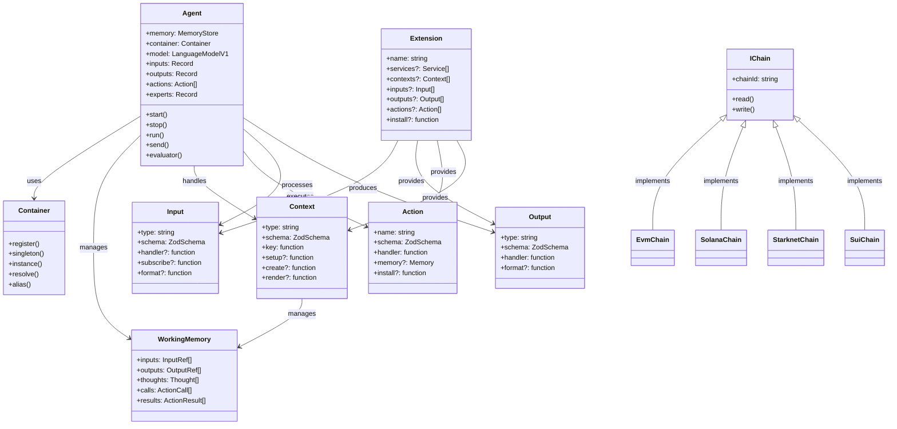

```mermaid

classDiagram
    class Agent {
        +memory: MemoryStore
        +container: Container
        +model: LanguageModelV1
        +inputs: Record<string, Input>
        +outputs: Record<string, Output>
        +actions: Action[]
        +experts: Record<string, Expert>
        +start()
        +stop()
        +run()
        +send()
        +evaluator()
    }

    class Context {
        +type: string
        +schema: ZodSchema
        +key: function
        +setup?: function
        +create?: function
        +render?: function
    }

    class WorkingMemory {
        +inputs: InputRef[]
        +outputs: OutputRef[]
        +thoughts: Thought[]
        +calls: ActionCall[]
        +results: ActionResult[]
    }

    class Extension {
        +name: string
        +services?: Service[]
        +contexts?: Context[]
        +inputs?: Input[]
        +outputs?: Output[]
        +actions?: Action[]
        +install?: function
    }

    class Container {
        +register()
        +singleton()
        +instance()
        +resolve()
        +alias()
    }

    class Action {
        +name: string
        +schema: ZodSchema
        +handler: function
        +memory?: Memory
        +install?: function
    }

    class Input {
        +type: string
        +schema: ZodSchema
        +handler?: function
        +subscribe?: function
        +format?: function
    }

    class Output {
        +type: string
        +schema: ZodSchema
        +handler: function
        +format?: function
    }

    class IChain {
        +chainId: string
        +read()
        +write()
    }

    Agent --> Container : uses
    Agent --> WorkingMemory : manages
    Agent --> Context : handles
    Agent --> Action : executes
    Agent --> Input : processes
    Agent --> Output : produces
    
    Extension --> Input : provides
    Extension --> Output : provides
    Extension --> Action : provides
    Extension --> Context : provides
    
    Context --> WorkingMemory : manages

    IChain <|-- EvmChain : implements
    IChain <|-- SolanaChain : implements
    IChain <|-- StarknetChain : implements
    IChain <|-- SuiChain : implements
```